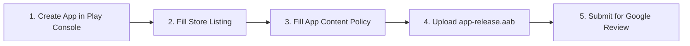

# 📱 Google Play Store Publishing Guide — LiteView

Welcome to the official publishing guide for **LiteView** (`v2.5.3`). This guide provides all pre-configured metadata, store listing copy, policy questionnaire answers, and step-by-step submission steps to publish LiteView to the Google Play Console without friction.

---

## 📌 1. App Metadata Overview

| Property | Value |
| :--- | :--- |
| **App Name** | `LiteView` |
| **Package Name** | `com.nexus.nexusdocs` |
| **Version Name** | `2.5.3` |
| **Version Code** | `253` |
| **Target SDK** | `35` (Android 15) |
| **Min SDK** | `26` (Android 8.0) |
| **Primary Category** | `Tools` / `Productivity` |
| **Support Email** | `sherawat003@gmail.com` |
| **Privacy Policy URL** | `https://lite-view.vercel.app/privacy.html` |

> [!NOTE]
> The legal Privacy Policy is deployed live at `https://lite-view.vercel.app/privacy.html` and available locally at [website/privacy.html](file:///d:/Kotlin/Dex%20Files/NexusDocsViewer/website/privacy.html).

---

## 📦 2. Build & Release Bundle (.aab)

To generate the signed Android App Bundle (`.aab`) for Google Play upload:

```powershell
.\gradlew.bat bundleRelease
```

### Output Bundle Details
- **Location**: `app/build/outputs/bundle/release/app-release.aab`
- **File Size**: `~39.8 MB`
- **Build Status**: Verified release build with R8 minification enabled.

---

## 📝 3. Store Listing Copy & Asset Specs

### Short Description *(80 characters max)*
> Fast, lightweight document viewer & scanner for PDF, Office files, and text docs.

### Full Description *(4000 characters max)*
```text
LiteView is a fast, lightweight, and privacy-focused document reader and scanner for Android. View, annotate, scan, and manage all your documents offline with maximum efficiency and high performance.

Key Features:
- 📄 PDF Reader & Annotator: View PDFs smoothly, add text highlights, freehand drawings, sticky notes, and digital signatures.
- 📊 Office Document Viewer: Open Word (.docx), Excel (.xlsx), and PowerPoint (.pptx) documents seamlessly.
- 📝 Text Reader: Quick viewing for plain text (.txt), Markdown (.md), and code files.
- 📷 Built-in Document Scanner: Scan physical documents into clean, multi-page PDF files directly using your camera.
- 📁 Offline File Management: Fast local file browsing with recent documents access, search, and bookmarking.
- ⚡ Modern & Clean UI: Built with Jetpack Compose, supporting dark mode and dynamic accent colors.
```

### Store Graphic Asset Requirements
| Graphic Asset | Specification | Requirement | Asset Reference |
| :--- | :--- | :--- | :--- |
| **App Icon** | `512 x 512 px` (PNG 32-bit with alpha) | **MANDATORY** | [app_icon.png](file:///d:/Kotlin/Dex%20Files/NexusDocsViewer/website/assets/app_icon.png) |
| **Feature Graphic Banner** | `1024 x 500 px` (JPEG or 24-bit PNG) | **MANDATORY** | [playstore_feature_graphic.png](file:///d:/Kotlin/Dex%20Files/NexusDocsViewer/website/assets/playstore_feature_graphic.png) |
| **Phone Screenshots** | Minimum 2 screenshots (16:9 or 9:16) | **MANDATORY** | PDF Reader & Scanner App Screenshots |

> [!IMPORTANT]
> **Yes, a 1024x500 Feature Graphic Banner is 100% MANDATORY for Google Play Store publishing.** Google Play Console will NOT allow you to publish your app without uploading this feature graphic banner. We have generated and included a custom 1024x500 banner ready for upload at `website/assets/playstore_feature_graphic.png`.

---

## 📋 4. Google Play Console Policy Cheat Sheet

Copy and paste these exact answers into the **App Content** declarations section of your Play Console dashboard:

### 🔒 Policy Questionnaire Answers

| Policy Section | Play Console Question | Required Answer |
| :--- | :--- | :--- |
| **Privacy Policy** | Provide Privacy Policy URL | `https://lite-view.vercel.app/privacy.html` |
| **App Access** | Is app functionality restricted? | **No, all functionality is available without restrictions.** |
| **Ads Declaration** | Does your app contain ads? | **No, my app does not contain ads.** |
| **Content Rating** | Category & Violence / Drugs / Profanity | Select **Utility/Tools** $\rightarrow$ Answer **No** to all content flags $\rightarrow$ Rating: **PEGI 3 / Everyone 3+** |
| **Target Audience** | Target Age Group | Select **13+, 16-17, 18+** $\rightarrow$ Appeal to children: **No** |
| **News App** | Is your app a news app? | **No** |
| **COVID-19 Status** | Is your app a COVID-19 contact app? | **No** |

---

### 🛡️ Data Safety Form Questionnaire

| Data Safety Question | Answer |
| :--- | :--- |
| **Does your app collect or share any user data?** | **No** |
| **Is all user data processed locally on device?** | **Yes** |
| **Is user data encrypted in transit?** | **N/A** *(No data transmitted over the network)* |
| **Do you provide a way for users to request data deletion?** | **Yes** *(Users can delete local files, annotations, or app data anytime directly from their device settings or file manager; no server accounts exist)* |

---

### 📂 All Files Access Permission (`MANAGE_EXTERNAL_STORAGE`)

If prompted to justify file storage access in the Play Console:

> [!IMPORTANT]
> **Declaration Core Functionality**: Document Reader, Manager & Camera Scanner.  
> **Justification Statement**:  
> *"LiteView is a local document reader and scanner. Its core feature is allowing users to search, open, read, annotate, edit, and organize PDF, Word, Excel, PowerPoint, and Text files stored across local device storage and external SD cards."*

---

## 🚀 5. Step-by-Step Submission Walkthrough



1. **Log in to Play Console**: Open [Google Play Console](https://play.google.com/console).
2. **Create New App**:
   - Title: `LiteView`
   - Default Language: `English (US)`
   - App Type: `App` | Pricing: `Free`
3. **Complete Main Store Listing**:
   - Copy & paste the **Short Description** and **Full Description** from Section 3.
   - Upload **App Icon**, **Feature Graphic**, and **Screenshots**.
4. **Complete App Content Declarations**:
   - Use the **Policy Cheat Sheet** tables in Section 4 to fill out all policy forms.
5. **Create Release & Upload Bundle**:
   - Go to **Production** $\rightarrow$ **Create new release**.
   - Upload `app/build/outputs/bundle/release/app-release.aab`.
   - Add Release Notes:
     ```text
     LiteView v2.5.2 Release Notes:
     - High-performance PDF rendering engine with smooth vector zooming.
     - Rich annotation tools, sticky notes, and digital signatures.
     - Built-in HD document camera scanner with auto edge alignment.
     - 100% offline security with zero data collection.
     ```
6. **Submit for Review**: Click **Review release** and submit your app for Google Play approval!
