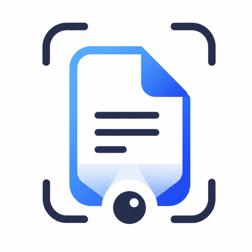
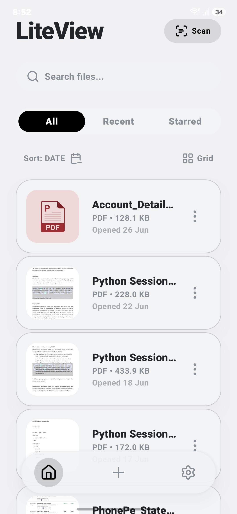
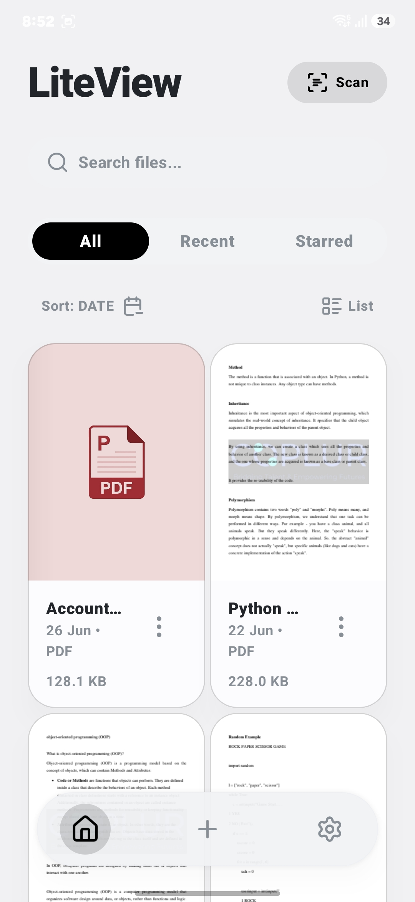
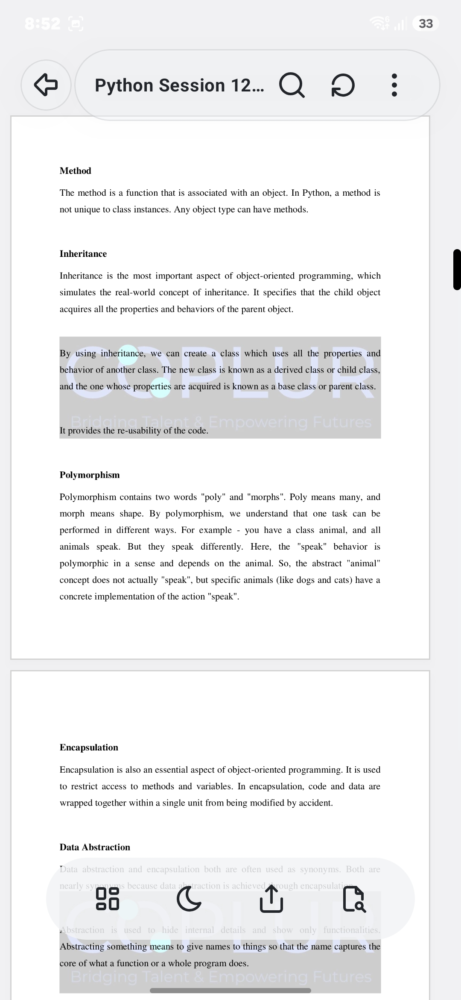
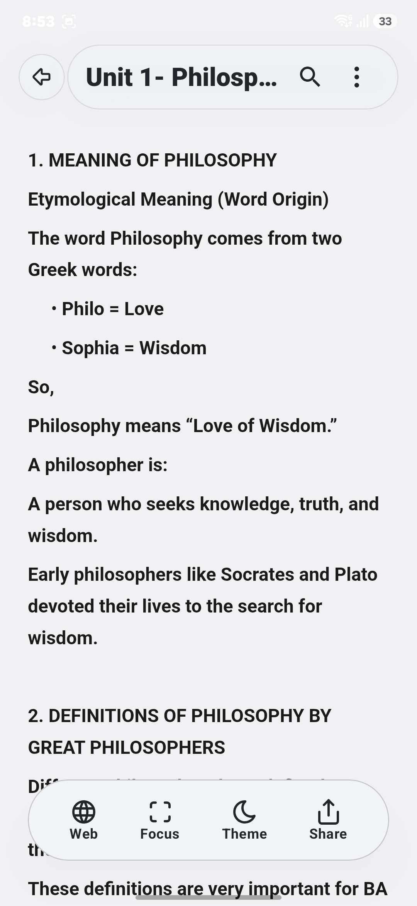
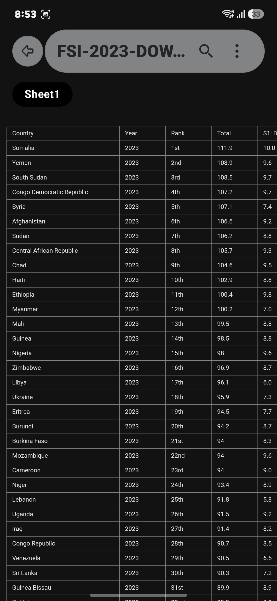
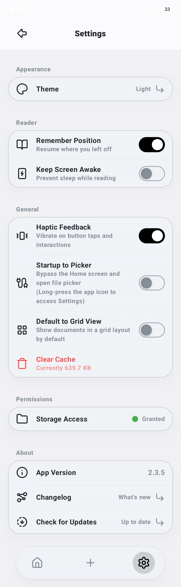

<div align="center">


</div>

---

<div align="center">



# LiteView — Document Viewer & Scanner

**A fast, elegant, and feature-rich Android document reader.**
View PDFs, Office files, and text documents. Scan physical documents directly with your camera.

</div>

---

## ✨ Key Features

| Feature | Description |
|---|---|
| 📑 **PDF Reader** | High-fidelity PDF rendering powered by **MuPDF 1.23** |
| 📊 **Office Support** | View `.docx`, `.xlsx`, and `.pptx` files via **Apache POI** |
| 📝 **Text Viewer** | Clean and readable plain text file support |
| 📸 **Document Scanner** | Scan physical pages to PDF or JPEG via **ML Kit Document Scanner** |
| 🔍 **OCR (Text Recognition)** | Extract text from scanned images using **ML Kit Text Recognition** |
| ⭐ **Starred Files** | Pin your most-used documents for quick access |
| 🗂️ **Smart Dashboard** | View All, Recent, and Starred files with sort & search |
| 🔲 **Multi-Select Actions** | Long-press to select multiple files, then share or delete them in bulk |
| 🌓 **Dark & Light Mode** | Full system theme support with a sleek custom design system |
| 🔄 **In-App Updates** | Checks for new versions automatically via the GitHub Releases API |
| 🔃 **Pull to Refresh** | Swipe down to re-scan the file system for new documents |

---

## 📱 Screenshots

<div align="center">

| Dashboard (List View) | Dashboard (Grid View) | PDF Reader |
|:---:|:---:|:---:|
|  |  |  |
| *All, Recent & Starred tabs with sort/search* | *2-column grid layout with PDF thumbnails* | *MuPDF-powered reader with page navigation* |

| Text / DOCX Reader | Spreadsheet (XLSX) — Dark Mode | Settings |
|:---:|:---:|:---:|
|  |  |  |
| *Clean, readable text & DOCX rendering* | *Excel spreadsheet viewer with AMOLED dark mode* | *Theme, reader preferences & in-app updater* |

</div>

---

## 🏗️ Architecture & Tech Stack

LiteView is built with a clean, scalable, multi-module architecture following **MVVM** and **Clean Architecture** principles.

### Module Structure

```
NexusDocsViewer/
├── app/                  # Application entry point, DI graph, Navigation
├── core/                 # Shared UI components, theme, navigation contracts
└── feature/
    ├── dashboard/        # Home screen, Recent/Starred/All file lists, Settings
    ├── reader-pdf/       # MuPDF-powered PDF reading experience
    ├── reader-office/    # Apache POI-powered Office document viewer
    ├── reader-text/      # Plain text file reader
    └── scanner/          # ML Kit document scanning & OCR
```

### Tech Stack

| Layer | Library / Tool |
|---|---|
| **Language** | Kotlin 2.0.21 |
| **UI** | Jetpack Compose BOM 2024.12, Material 3 |
| **Architecture** | MVVM, multi-module, Clean Architecture |
| **Dependency Injection** | Hilt 2.53.1 |
| **Navigation** | Navigation Compose 2.8.5 |
| **Database** | Room 2.6.1 (recent documents history) |
| **Preferences** | DataStore Preferences 1.1.1 |
| **Async** | Kotlin Coroutines 1.9.0 + StateFlow |
| **PDF Engine** | MuPDF (fitz) 1.23.0 |
| **Office Parsing** | Apache POI 5.2.5 |
| **ML / AI** | Google ML Kit — Document Scanner & Text Recognition |
| **Image Loading** | Coil 2.6.0 |
| **Animations** | Jetpack Compose Animation + Shared Element Transitions |
| **Permissions** | Accompanist Permissions 0.36.0 |
| **Updates** | GitHub Releases REST API (custom `AppUpdater`) |

---

## 🚀 Getting Started

### Prerequisites

- **Android Studio** Hedgehog (2023.1.1) or newer
- **JDK 17**
- **Android SDK** with API Level 26+ installed

### Cloning & Running

```bash
# 1. Clone the repository
git clone https://github.com/manish-sherawat/LiteView.git

# 2. Open the project in Android Studio
# (File -> Open -> select the NexusDocsViewer folder)

# 3. Let Gradle sync finish

# 4. Run the app on a device or emulator (API 26+)
```

### Building a Release APK

```bash
# From the project root
./gradlew assembleRelease

# The signed APK will be located at:
# app/build/outputs/apk/release/app-release.apk
```

---

## 📁 Project Deep Dive

### `core` Module

The foundation of the app. Contains:
- **`NexusTheme`** — Custom design system (colors, typography, shapes)
- **`NexusComponents`** — Reusable UI components (`NexusCard`, `NexusButton`, `NexusDialog`, etc.)
- **`NexusBottomNav`** — Custom animated bottom navigation bar
- **`NexusTopBar`** — Adaptive top app bar
- **`navigation/`** — Navigation contracts, `DocumentReaderRouter`, `DocumentType` enum
- **`preferences/`** — `UserPreferencesRepository` (DataStore-backed user settings)
- **`updater/`** — `AppUpdater` service for checking GitHub Releases

### `feature/dashboard` Module

The main home screen. Contains:
- **`DashboardScreen`** — File list (All / Recent / Starred tabs), search, sort, pull-to-refresh
- **`DashboardViewModel`** — Manages UI state, file scanning, multi-select mode
- **`FileListItem` & `FileGridItem`** — Animated file card components
- **`FileOptionsDialog`** — Per-file contextual action sheet (Share, Rename, Star, Details, Delete)
- **`SettingsScreen`** — App settings, cache management, AMOLED mode, changelog viewer
- **`RecentDocumentRepository`** — Room-backed persistent recent documents list

### `feature/reader-pdf` Module

Full-featured PDF reader powered by **MuPDF**:
- Pinch-to-zoom, page-by-page navigation
- Scroll position persistence (remembers last read page)
- PDF thumbnail generation with caching
- Shared element hero transition from dashboard thumbnail

### `feature/reader-office` Module

Office document reader using **Apache POI**:
- Supports `.docx`, `.xlsx`, `.pptx` formats
- Renders content in a clean, readable Compose layout

### `feature/scanner` Module

Physical document scanning powered by **Google ML Kit**:
- Uses the built-in `GmsDocumentScanner` for automatic edge detection, cropping, and perspective correction
- Saves output as **PDF** or **JPEG**
- OCR text extraction from scanned images using `TextRecognition`

---

## 🎨 Design System

LiteView uses a bespoke design language called **Nexus Design System**, implemented entirely in Jetpack Compose:

- **Glassmorphism** — Frosted glass effect on floating UI surfaces (multi-select action bar, dialogs)
- **Shared Element Transitions** — Hero animations from file card thumbnail to full reader
- **Staggered Animations** — Progressive fade-and-slide for file list items
- **Spring-Based Micro-Interactions** — Bouncy, responsive press animations on every interactive element
- **AMOLED Dark Mode** — Optional pitch-black dark mode for OLED displays
- **Document Accent Colors** — Each file type (PDF, DOCX, XLSX, TXT) has its own curated accent color

---

## 🔧 Configuration

### In-App Update Configuration

The app uses a custom GitHub Releases-based updater. To point it at your own repository, update these values in [`AppUpdater.kt`](core/src/main/kotlin/com/nexus/core/updater/AppUpdater.kt):

```kotlin
private val githubOwner = "manish-sherawat" // Your GitHub username
private val githubRepo  = "LiteView"         // Your repository name
```

The updater will automatically fetch the latest release, compare versions, and prompt users to download the new APK if one is available.

---

## 🗺️ Roadmap

See [`future_enhancements.txt`](future_enhancements.txt) for the full list. Key upcoming features:

- [ ] **AI — Chat with Document** (Gemini API integration)
- [ ] **AI — Auto-Summarization** (TL;DR for long documents)
- [ ] **Folder & Tag Management** (custom organization beyond Starred)
- [ ] **Cloud Backup Hub** (Google Drive / Dropbox sync)
- [ ] **Comprehensive Onboarding** (3-step first-launch carousel)
- [ ] **PDF Bookmarks & Outline** (table of contents navigation)
- [ ] **Material You Dynamic Colors** (Android 12+ wallpaper-based theming)

---

## 🤝 Contributing

Contributions are welcome! Please follow these steps:

1. Fork the repository
2. Create a new feature branch: `git checkout -b feature/your-feature-name`
3. Commit your changes: `git commit -m 'feat: add some amazing feature'`
4. Push to the branch: `git push origin feature/your-feature-name`
5. Open a Pull Request

Please ensure your code follows the existing architecture and code style.

---

## 📄 License

This project is licensed under the **MIT License** — see the [LICENSE](LICENSE) file for details.

---

<div align="center">

Made with ❤️ by **Manish Sherawat** X **Antigravity**

**[GitHub](https://github.com/manish-sherawat) · [Report a Bug](https://github.com/manish-sherawat/LiteView/issues) · [Request a Feature](https://github.com/manish-sherawat/LiteView/issues)**

</div>
